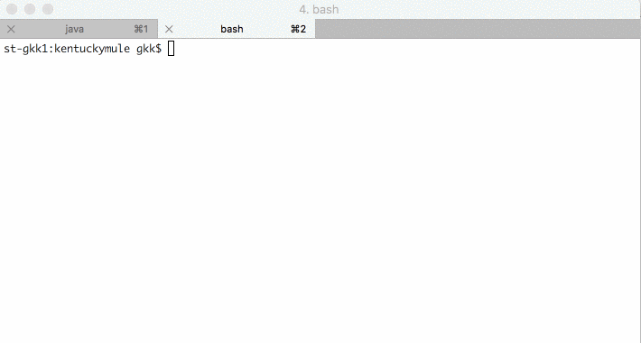

# Kentucky Mule

Kentucky Mule is an exploration of an alternative architecture for Scala
compiler design (specifically typechecker) with focus on speed. Kentucky Muke's
lessons are not limited to Scala and apply to a wide range of possible
compilers.

Kentucky Mule's origins are described in my blog post [Can Scala have a highly
parallel
typechecker?](https://medium.com/@gkossakowski/can-scala-have-a-highly-parallel-typechecker-95cd7c146d20)

Since the time I wrote the blog post, I rephrased the original question into a
twofold one with only winning outcomes:

> How to build a highly parallel and high performance typechecker, or does >
Scala have a fundamental language design flaw that prevents such from being
built?

The prototype in this repo computes outline types I described in the blog post.
The outline types enable computation of dependencies between symbols in the
symbol table. Let's see this in action.

## Demo

Kentucky Mule is processes over two thousand lines of code in 600ms on a cold
JVM.

Once JVM is warmed up the parser becomes bottleneck. If I skip parsing in
benchmarking, Kentucky Mule calculates outline types at speed of processing over
4.4 million lines of Scala code per second.

If I add dependency extraction and analysis (as presented above) of scalap
sources, the performance is at 1.8 million lines of Scala code per second.
